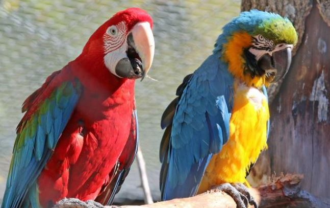
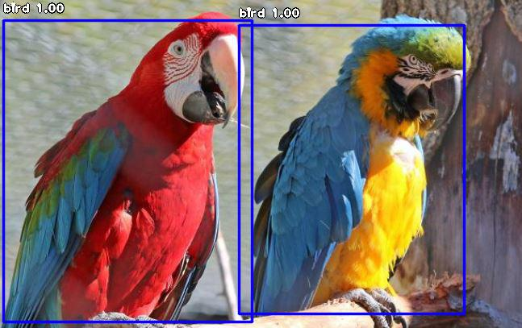
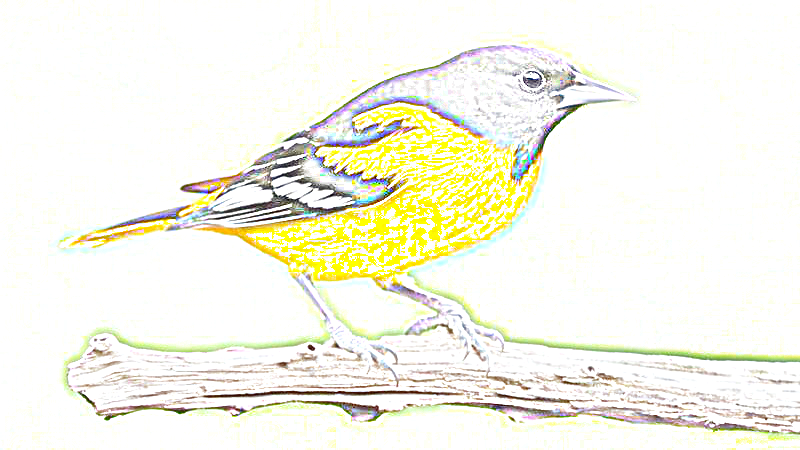
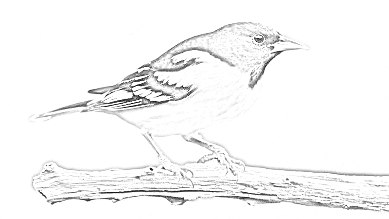
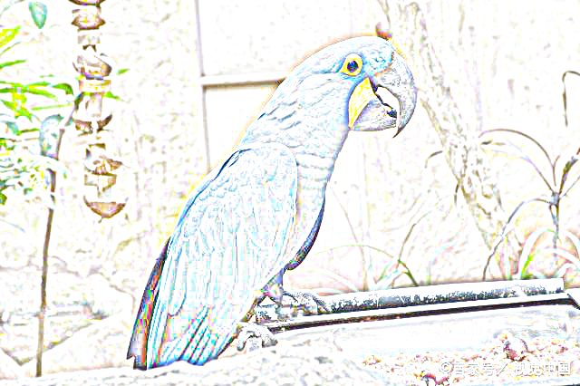
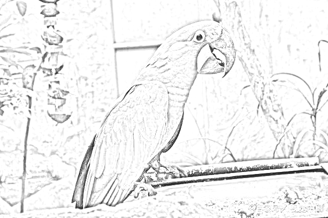

# Python Example
Study the example of python.

## Detect AI:

  
  
Detect Object

  
  * Docker File : [Download](./dockerfiles/Dockerfile.Detect_object)  
  
  * Training module yolo.h5 : [Download](https://github.com/OlafenwaMoses/ImageAI/releases/download/1.0/yolo.h5)
  
  * Result
  
  <table width="100%" align="center" border="0">    
    <tr>
      <td width="50%" align="center">befor</td>
      <td width="50%" align="center">after</td>
    </tr>
    <tr>
      <td width="50%" align="center"></td>
      <td width="50%" align="center"></td>
    </tr>    
  </table>
  

## Image Process

  
  
Sketches (素描圖)

  
  * Result
  
  <table width="100%" align="center" border="0">    
    <tr>
      <td width="50%" align="center">Color</td>
      <td width="50%" align="center">Gray</td>
    </tr>
    <tr>
      <td width="50%" align="center"></td>
      <td width="50%" align="center"></td>
    </tr>
    <tr>
      <td width="50%" align="center">Color</td>
      <td width="50%" align="center">Gray</td>
    </tr>
    <tr>
      <td width="50%" align="center"></td>
      <td width="50%" align="center"></td>
    </tr>
  </table>
  

