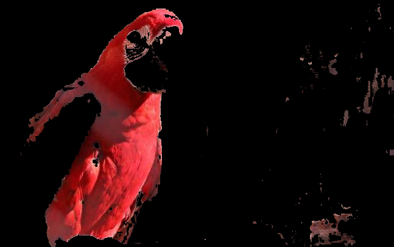

# Python Example
Study the example of python.

## Detect AI:

  
  
Detect Object
  
  
  * Docker File : [Download](./dockerfiles/Dockerfile.Detect_object)
  * Training module yolo.h5 : [Download](https://github.com/OlafenwaMoses/ImageAI/releases/download/1.0/yolo.h5)
  
  * File Name : [detect_object.py](./detect_ai/detect_object.py) 
  * Result
  
  <table width="100%" align="center" border="0">    
    <tr>
      <td width="50%" align="center">befor</td>
      <td width="50%" align="center">after</td>
    </tr>
    <tr>
      <td width="50%" align="center"></td>
      <td width="50%" align="center"></td>
    </tr>    
  </table>
  

  
  
Detect Color
  
  
  * Docker File : [Download](./dockerfiles/Dockerfile.Detect_object)  
  
  * File Name : [detect_color_01.py](./detect_ai/detect_color_01.py) 
  * Result
  
  <table width="100%" align="center" border="0">    
    <tr>
      <td width="30%" align="center">Original</td>
      <td width="30%" align="center">Mask</td>
      <td width="30%" align="center">Result</td>
    </tr>
    <tr>
      <td width="30%" align="center"></td>
      <td width="30%" align="center"></td>
      <td width="30%" align="center"></td>
    </tr>    
  </table>
  
  * File Name : [detect_color_02.py](./detect_ai/detect_color_02.py) 
  * Result
  
  <table width="100%" align="center" border="0">    
    <tr>
      <td width="30%" align="center">Original</td>
      <td width="30%" align="center">Mask</td>
      <td width="30%" align="center">Result</td>
    </tr>
    <tr>
      <td width="30%" align="center"></td>
      <td width="30%" align="center"></td>
      <td width="30%" align="center"></td>
    </tr>    
  </table>
  

## Image Process

  
  
Sketches (素描圖)

  
  * File Name : [sketches.py](./image_process/sketches.py)
  * Result
  
  <table width="100%" align="center" border="0">    
    <tr>
      <td width="30%" align="center">Original</td>
      <td width="30%" align="center">Color</td>
      <td width="30%" align="center">Gray</td>      
    </tr>
    <tr>
      <td width="30%" align="center"></td>
      <td width="30%" align="center"></td>
      <td width="30%" align="center"></td>      
    </tr>
    <tr>
      <td width="30%" align="center">Original</td>
      <td width="30%" align="center">Color</td>
      <td width="30%" align="center">Gray</td>
    </tr>
    <tr>
      <td width="30%" align="center"></td>
      <td width="30%" align="center"></td>
      <td width="30%" align="center"></td>
    </tr>
  </table>
  

  
  
S-Curve

  
  * File Name : [s-curve_01.py](./image_process/s-curve_01.py)
  * Result
  
  <table width="100%" align="center" border="0">    
    <tr>
      <td width="30%" align="center">k = 0.1</td>
      <td width="30%" align="center">k = 0.05</td>         
    </tr>
    <tr>      
      <td width="50%" align="center"></td>
      <td width="50%" align="center"></td>      
    </tr>    
  </table>
  

